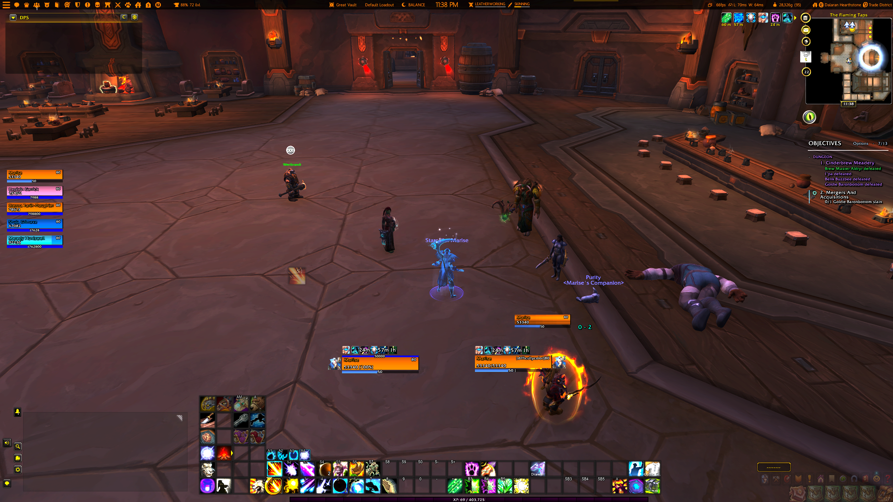
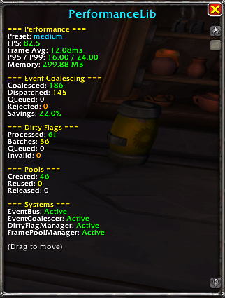
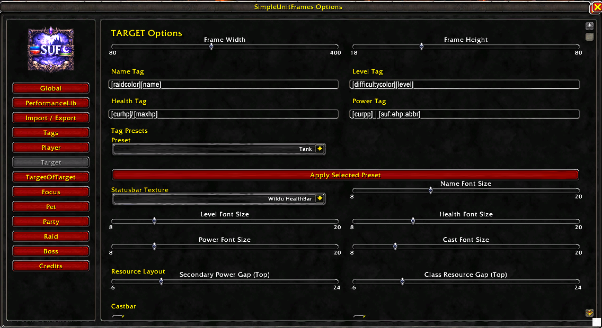
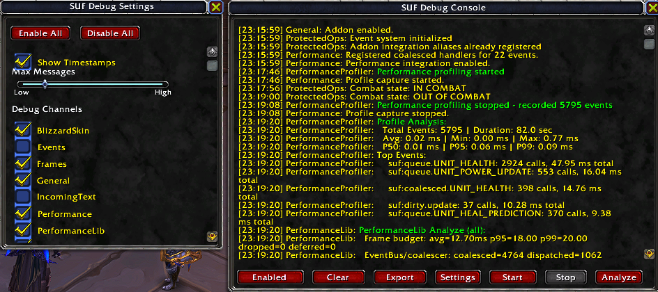

# SimpleUnitFrames (SUF)

SimpleUnitFrames is a comprehensive, modular unit frame replacement for World of Warcraft Retail. Built on `oUF` with Ace3 configuration, it focuses on unit frame customization and optional `PerformanceLib` integration for advanced event coalescing, performance profiling, and diagnostics.

## Recent Updates

- **Blizzard Frame Integration** — Per-frame hide controls for default unit frames with Edit Mode visibility toggle and global options
- **Health Color Hardening** — Threat/reaction/class colors now safe against WoW 12.0.0+ secret value restrictions
- **Data Text/Bars System** — New draggable data bar framework with Shift+click-restricted drag handles, XP/Reputation fade controls, and dynamic repositioning
- **Portrait Alpha Syncing** — Portraits now follow frame fader alpha for consistent frame transparency effects
- **Safe Theming Helpers** — Added `ApplySUFBackdropColors()` utility for backdrop styling with safe color fallbacks
- **Plugin Compatibility** — Broad oUF compatibility shims for aura iteration, unpacking, and secret-value handling across different runtime environments

## Screenshots

### SUF Screen UI


### SUF Performance Stats


### SUF Options


### SUF Debug Console


## Features

### Core Unit Frame System
- **Frame Types** — Player, Target, Target-of-Target, Focus, Pet, Party, Raid, and Boss frames
- **Customization** — Per-unit sizing, media, fonts, portraits, castbars, and aura sizing
- **Advanced Rendering** — Tag-driven text system with health, power, absorbs, heal prediction, and custom SUF tags
- **Aura System** — Configurable aura display with icon sizing, buff/debuff filtering, and preview tooltips
- **Edit Mode Integration** — Full compatibility with Blizzard Edit Mode for frame positioning

### Performance & Diagnostics
- **PerformanceLib Integration** — Optional advanced performance systems including:
  - Event coalescing with adaptive priorities (CRITICAL/HIGH/MEDIUM/LOW)
  - Dirty flag batching for efficient frame updates
  - Frame time budgeting and frame pooling
  - Real-time performance dashboard (`/sufdebug`)
  - Timeline profiling with bottleneck analysis (`/SUFprofile`)
  - ML-based priority optimization (learns from gameplay patterns)
- **Relevance Filtering** — Smart event queueing reduces unnecessary event pressure during combat
- **Diagnostics Panel** — Real-time logs with system filters, debug channels, and exportable data

### Data Bars & Text System
- **Draggable Data Bars** — Repositionable bars for XP, reputation, and custom data displays
- **Shift+Click Drag Handles** — Drag handles restricted to Shift+click for accidental protection
- **XP/Reputation Control** — Per-bar visibility and fade behavior tied to data bar settings
- **Customizable Text** — Data text system with multiple text display options

### Options & Configuration
- **Unified Options Window** — Tabbed interface with search v2 (relevance scoring, grouped results, keyboard navigation)
- **PerformanceLib Tab** — Preset selection, snapshot metrics, and integration shortcuts
- **Global Settings** — Universal options including Blizzard frame visibility control
- **Per-Unit Presets** — Tag preset system (compact/healer/tank/dps/minimal) for quick style switching
- **Import/Export** — Profile wizard with validation, preview, and rollback on failure
- **Minimap/LDB Support** — Launcher with quick-access actions and settings menu

## Quick Start

### Installation
1. Place `SimpleUnitFrames` in your WoW AddOns folder
2. (Optional) Install `PerformanceLib` for advanced performance features
3. Reload UI or restart WoW

### Basic Commands
| Command | Purpose |
|---------|---------|
| `/suf` | Open SimpleUnitFrames options |
| `/sufdebug` | Toggle debug console with logs and filtering |
| `/SUFprotected` | Show protected operations queue stats |
| `/SUFperf` | Toggle real-time performance dashboard (requires PerformanceLib) |

### Performance Profiling (PerformanceLib)
```
/SUFprofile start      # Begin timeline recording (max 10000 events)
/SUFprofile stop       # End recording
/SUFprofile analyze    # Show FPS metrics, frame time percentiles, bottlenecks
/SUFprofile export     # Copy timeline data to clipboard

/SUFpreset low|medium|high|ultra     # Change performance preset
/SUFpreset auto on|off               # Toggle auto-optimization based on hardware
/SUFpreset recommend                 # Get preset recommendations
```

## Custom Tags

SimpleUnitFrames provides extended tag support beyond standard oUF tags:

| Tag | Purpose |
|-----|---------|
| `[suf:absorbs]` | Absorb shield amount with condensed formatting |
| `[suf:incoming]` | Incoming heal prediction |
| `[suf:ehp]` | Effective health (health + absorbs) |
| `[suf:missinghp]` | Missing health value |
| `[suf:missingpp]` | Missing power value |
| `[suf:status]` | Unit status (dead, ghost, offline) |
| `[suf:name]` | Unit name with class color |

**Note:** Due to WoW 12.0.0+ secret value restrictions, some numeric prediction values may be unavailable in certain contexts. SUF prioritizes stable, taint-safe rendering over unreliable numeric display.

## Known Limitations

- **Secret Values (WoW 12.0.0+)** — Some prediction API returns are restricted; SUF uses safe fallback colors and text when values are unavailable
- **PerformanceLib Features** — Advanced diagnostics and ML optimization only available when PerformanceLib addon is installed
- **Broker/LDB** — Minimap behavior depends on optional broker libraries present in the addon environment

## API Reference (Addon Integration)

If you are extending SUF internally/modules:

```lua
addon:GetUnitSettings(unitType)
addon:GetUnitFontSizes(unitType)
addon:GetUnitStatusbarTexture(unitType)
addon:GetUnitCastbarSettings(unitType)
addon:GetUnitLayoutSettings(unitType)
addon:GetUnitHealPredictionSettings(unitType)
addon:GetUnitCastbarColors(unitType)
addon:GetUnitAuraSize(unitType)

addon:SetPerformanceIntegrationEnabled(enabled[, silent])
addon:QueuePerformanceEvent(eventName, ...)

addon:SerializeProfile()
addon:DeserializeProfile(input)
addon:ValidateImportedProfileData(data)
addon:BuildImportedProfilePreview(data[, report])
addon:ApplyImportedProfile(data)
```

## Architecture & Documentation

### Key Modules
- **[SimpleUnitFrames.lua](SimpleUnitFrames.lua)** — Core addon initialization, profile management, unit configuration, and custom tag registration
- **[Core/ProtectedOperations.lua](Core/ProtectedOperations.lua)** — Unified combat lockdown handling with priority-based operation queueing
- **[Modules/UI/](Modules/UI/)** — Options window, debug panel, and data bar system with theming helpers
- **[Units/](Units/)** — oUF unit frame builders for each frame type

### Documentation
- [DEVELOPER_NOTES.md](docs/DEVELOPER_NOTES.md) — Safe extension patterns and contribution guidelines
- [MIGRATION.md](docs/MIGRATION.md) — Profile migration and import system details
- [PROTECTED_OPERATION_ANALYSIS.md](docs/PROTECTED_OPERATION_ANALYSIS.md) — Combat lockdown handling deep dive

### Development
- Use `addon:QueueOrRun(func, opts)` for all frame mutations during combat
- Localize frequently-called globals with "PERF LOCALS" pattern for performance
- Use `SafeNumber()`, `SafeText()`, and `SafeAPICall()` wrappers for WoW 12.0.0+ compatibility
- Reference [copilot-instructions.md](.github/copilot-instructions.md) for project conventions and integration patterns

## Dependencies

### Core Framework
- **oUF** — Unit frame and element system
- **Ace3** — AceAddon-3.0, AceDB-3.0, AceGUI-3.0, AceConsole-3.0, AceEvent-3.0, AceSerializer-3.0

### Configuration & Serialization
- **LibSharedMedia-3.0** — Texture and font registration/lookup
- **LibSerialize** — Data serialization
- **LibDeflate** — Data compression
- **LibDualSpec-1.0** — Per-specialization profiles

### Integration & Optional
- **PerformanceLib** (optional) — Event coalescing, profiling, ML optimization, diagnostics
- **LibDataBroker-1.1** (optional) — Minimap/LDB broker support
- **LibDBIcon-1.0** (optional) — Minimap icon management

### Utilities & Enhancements
- **LibDispel-1.0** — Dispel helper functions
- **LibCustomGlow-1.0** — Glow effects
- **LibSimpleSticky** — Window snapping
- **LibTranslit-1.0** — Text transliteration
- **LibAnim** — Animation utilities
- **TaintLess** — Taint management
- **LibAceConfigHelper** — Configuration UI helpers
- **UTF8** — Unicode text handling

## Compatibility

- **WoW Version** — Retail (interface version 120001, WoW 12.0.0+)
- **Saved Variables** — `SimpleUnitFramesDB`
- **Lua Version** — Lua 5.1 (WoW standard)
- **PerformanceLib** — Optional (gracefully degrades if not installed)

## Credits & Attribution

### Project Lead
- **Grevin** — SimpleUnitFrames author and maintainer

### Core Contributors
- **oUF Authors** — Foundational unit frame framework
- **Ace3 Community** — AceAddon, AceDB, AceGUI, and related libraries
- **WoWAddonAPIAgents** — API documentation and widget references
- **Gethe & Community** — wow-ui-source Blizzard reference implementations

### Feature Attribution
- **UnhaltedUnitFrames (UUF)** — Frame design reference and architectural guidance

### Integration Partners
- **PerformanceLib** — Optional performance systems (event coalescing, profiling, ML optimization)
- **LibSharedMedia-3.0** — Texture and font management
- **LibDualSpec-1.0** — Per-spec profile support

### Utility Libraries
- **LibDataBroker-1.1** & **LibDBIcon-1.0** — Minimap/LDB support
- **LibDispel-1.0**, **LibCustomGlow-1.0**, **LibSimpleSticky** — UI enhancements
- **LibDeflate**, **LibSerialize**, **LibAceConfigHelper** — Data handling and configuration

## License

SimpleUnitFrames follows the project repository license.  
`PerformanceLib` integration remains under its own library license terms.
